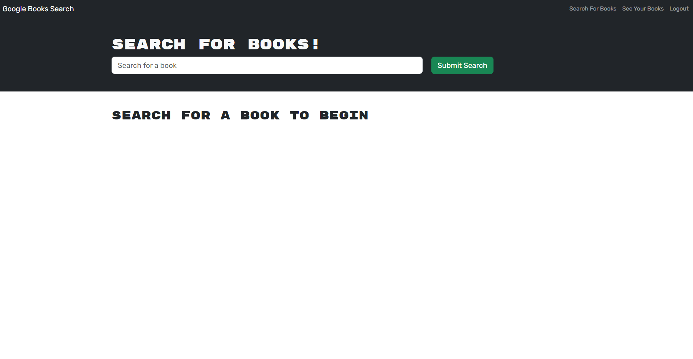
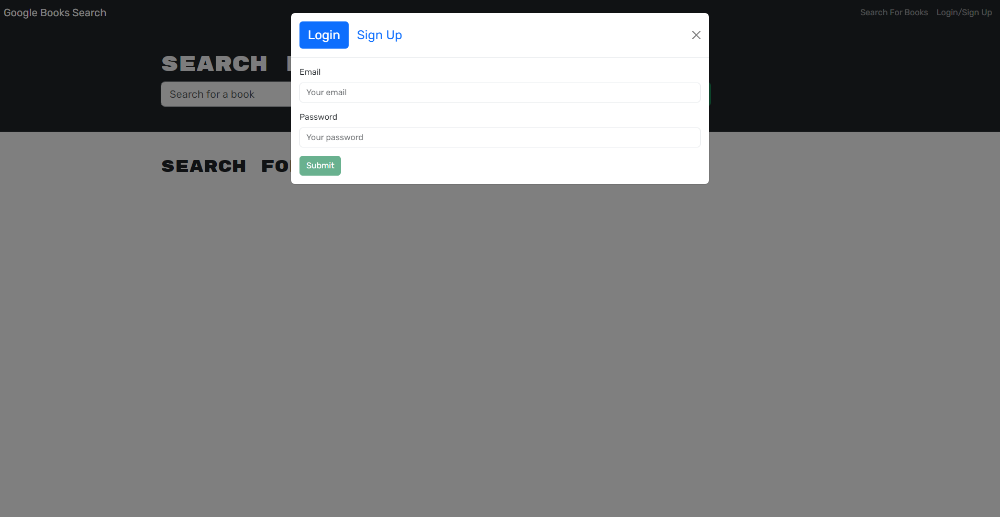
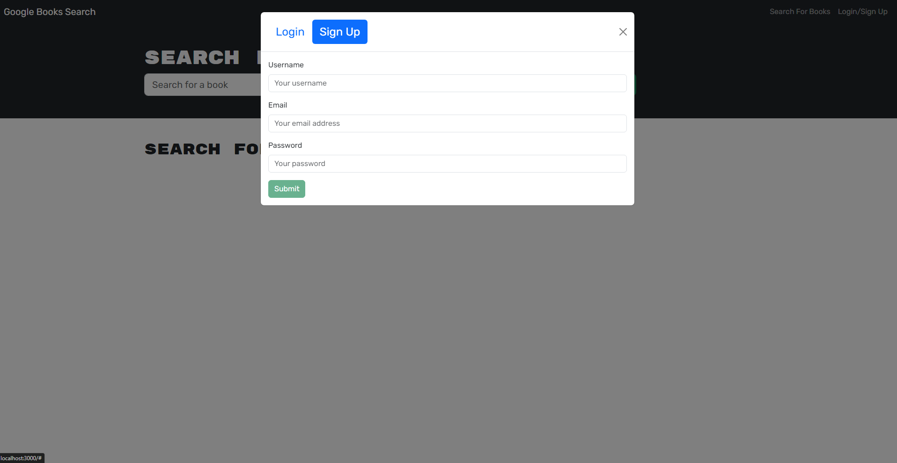
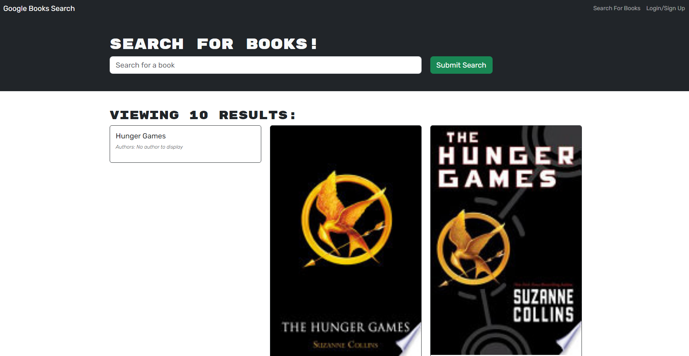
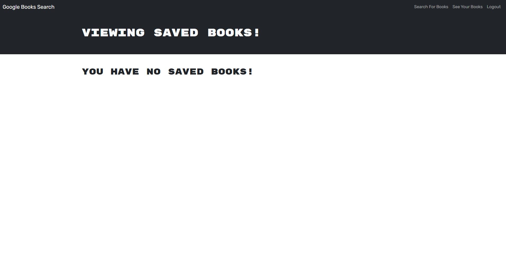

# MERN Google Book Search Engine

[Heroku Deploy Link](https://brandon-mern-book-search-75bcaaaac109.herokuapp.com/)

## Description

The Book Search Engine project was to refactor existing code from RESTful API to use the GraphQL API built using the Apollo Server. All of the existing routes are replaced with queries and mutations. This app is deployed on Heroku, and is build using MongoDB, Express.js, React, and Node.js. Users can save book searches to the back end after signing up, and that data will be saved for the next time they login.

## Table of Contents

- [Installation](#installation)
- [Usage](#usage)
- [Features](#features)
- [License](#license)
- [Questions](#questions)

## Installation

1. Clone the repository from GitHub using the command:

   ```bash
   git clone git@github.com:Bwing2/brandon-book-search-engine.git
   ```

2. Navigate to the project directory:

   ```bash
   cd brandon-book-search-engine
   ```

3. Install all dependencies in the root of the project to get both client and server side npm packages with the command:

   ```bash
   npm run install
   ```

4. The installed npm packages include:

   ```bash
   Root Dev Dependencies:
    concurrently
    nodemon

   Server Dependencies:
    @apollo/server
    apollo-server-express
    bcrypt
    express
    graphql
    jsonwebtoken
    mongoose

   Client Dependencies
    @apollo/client
    bootstrap
    graphql
    jwt-decode
    react
    react-bootstrap
    react-dom
    react-router-dom

   Client Dev Dependencies:
    @types/react
    @types/react-dom
    @vitejs/plugin-react
    eslint
    eslint-plugin-react
    eslint-plugin-react-hooks
    eslint-plugin-react-refresh
    vite
   ```

5. Start the development server using the `concurrently` package to run two commands simultaneously in different terminal sessions.

   ```bash
   npm run develop
   ```

6. The application will then run on http://localhost:3000 in your default web browser.

## Usage

Users can signup, login, search for books, and save/delete books after logging in.

### Homepage



### Login Page



### Sign Up Page



### Book Search



### Book Search After Login


### Empty Saved Books Page After Login



### Delete Saved Books


## Features

1. **User Sign Up and Login Authentication:**
   JSON Web Tokens (JWT) are used for login authentication, as well as bcrypt for hashing passwords.

2. **Searching For Books:**
   Books can be searched using their title and author using the Google Books API.

3. **Saved Books Page:**
   All books saved by a user can be found under the "See Your Books" tab.

4. **Saving and Deleting Books:**
   Logged in users can save and delete books to and from their books section.

## License


## Questions

You are welcome to contact me with questions using the following:

- [GitHub Profile](https://github.com/bwing2)

- [Email](mailto:brandon.wing245@gmail.com)
